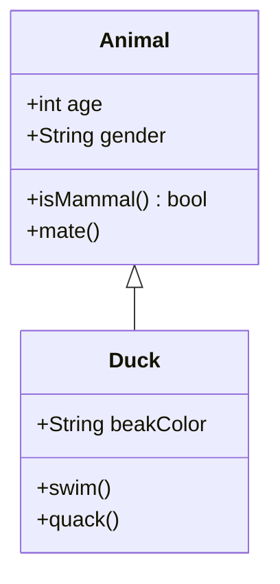
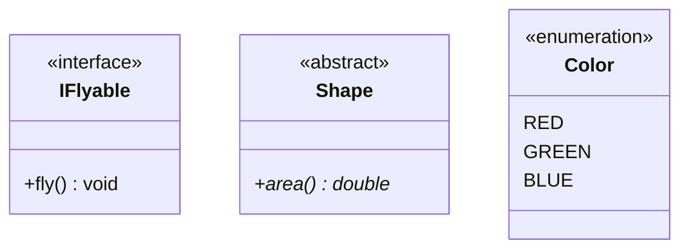
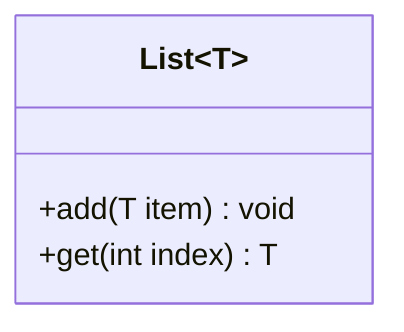
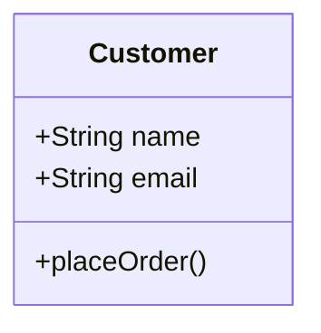
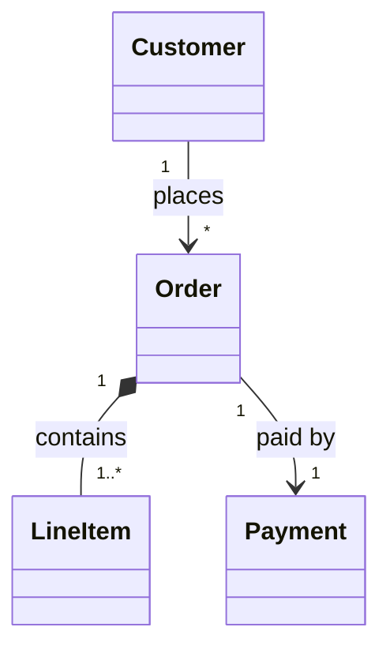
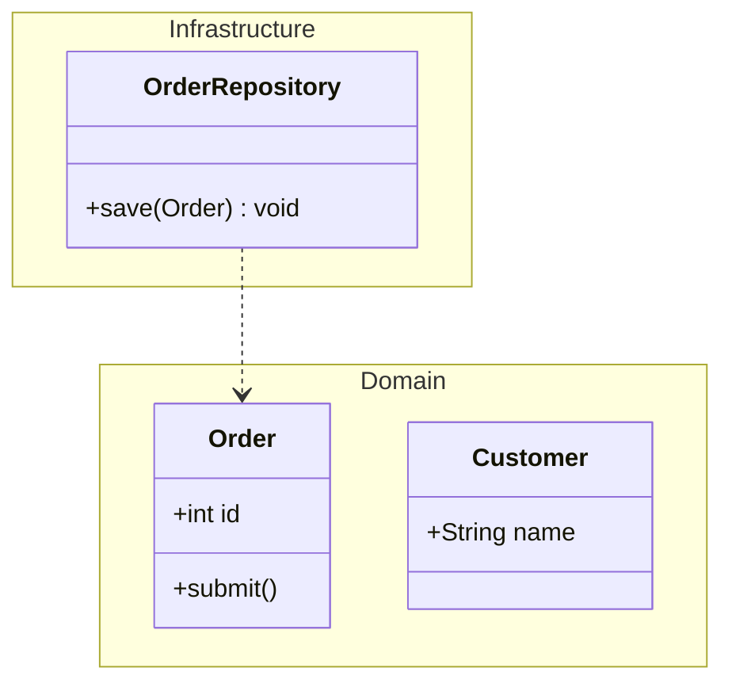
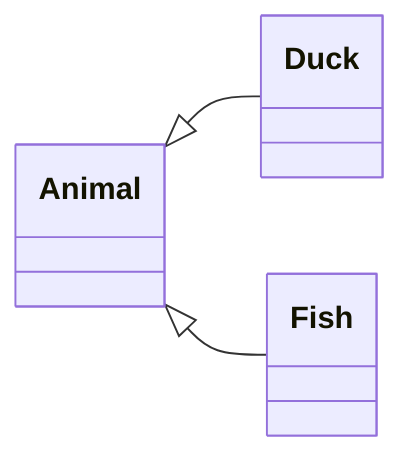

# Class Diagrams

## Basics



## Visibility Markers

| Marker | Meaning |
|--------|---------|
| `+` | Public |
| `-` | Private |
| `#` | Protected |
| `~` | Package/internal |

## Member Modifiers

- Static: append `$` → `+staticMethod()$`
- Abstract: append `*` → `+abstractMethod()*`

## Return Types

```
+getAge() int
+setName(String name) void
```

## Annotations



## Generics



## Inline Attributes



## Relationships

| Type | Syntax | Marker |
|------|--------|--------|
| Inheritance | `<\|--` | Hollow triangle |
| Composition | `*--` | Filled diamond |
| Aggregation | `o--` | Hollow diamond |
| Association | `-->` | Open arrow |
| Dependency | `..>` | Dashed open arrow |
| Realization | `..\|>` | Dashed hollow triangle |

### With Cardinality and Labels



## Namespaces



## Direction

Default is top-down. Use `direction` to change:


