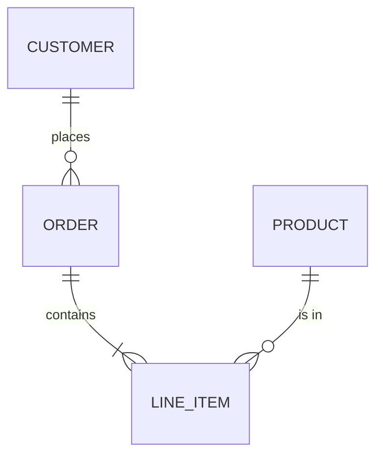
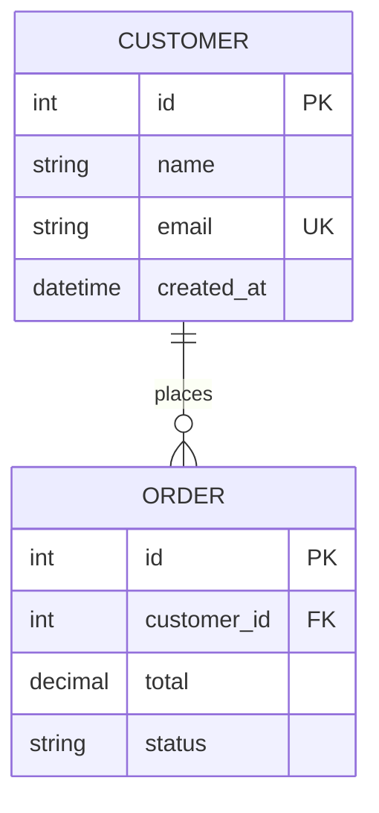
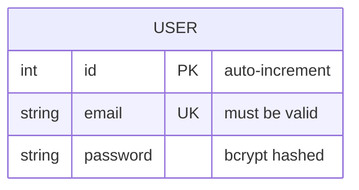
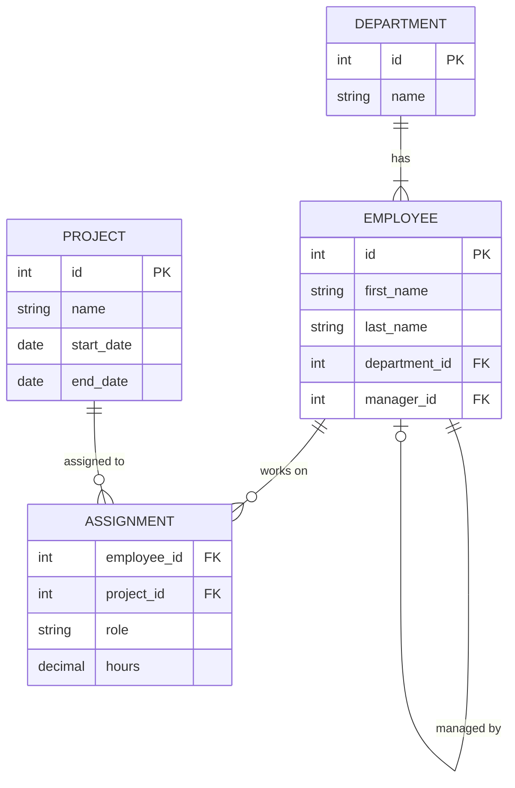

# ER Diagrams

## Basics

## Entity Attributes

## Key Constraint Badges

| Badge | Meaning |
|-------|---------|
| `PK` | Primary Key |
| `FK` | Foreign Key |
| `UK` | Unique Key |

## Attribute Comments

## Cardinality (Crow's Foot Notation)

| Left | Right | Meaning |
|------|-------|---------|
| `\|\|` | `\|\|` | Exactly one to exactly one |
| `\|\|` | `o\|` | Exactly one to zero or one |
| `\|\|` | `\|{` | Exactly one to one or more |
| `\|\|` | `o{` | Exactly one to zero or more |
| `o\|` | `o{` | Zero or one to zero or more |
| `}o` | `o{` | Zero or more to zero or more |

## Line Styles

| Syntax | Meaning |
|--------|---------|
| `--` | Identifying relationship (solid line) |
| `..` | Non-identifying relationship (dashed line) |

## Full Example

