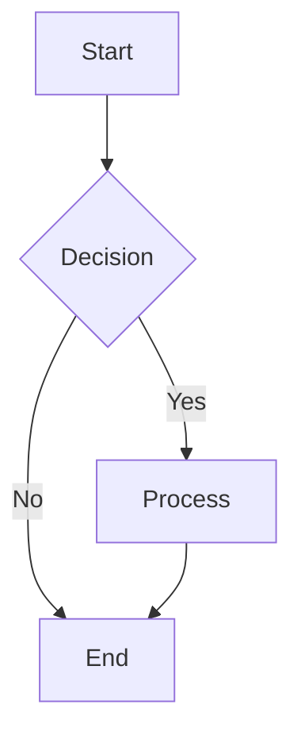
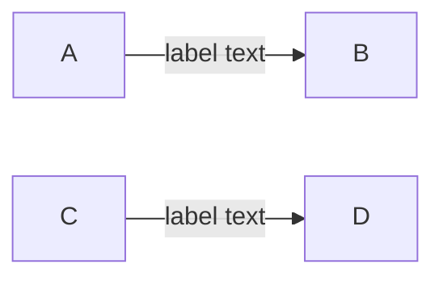
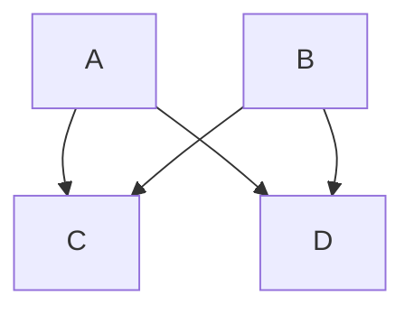
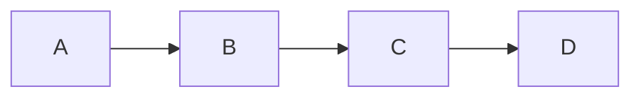
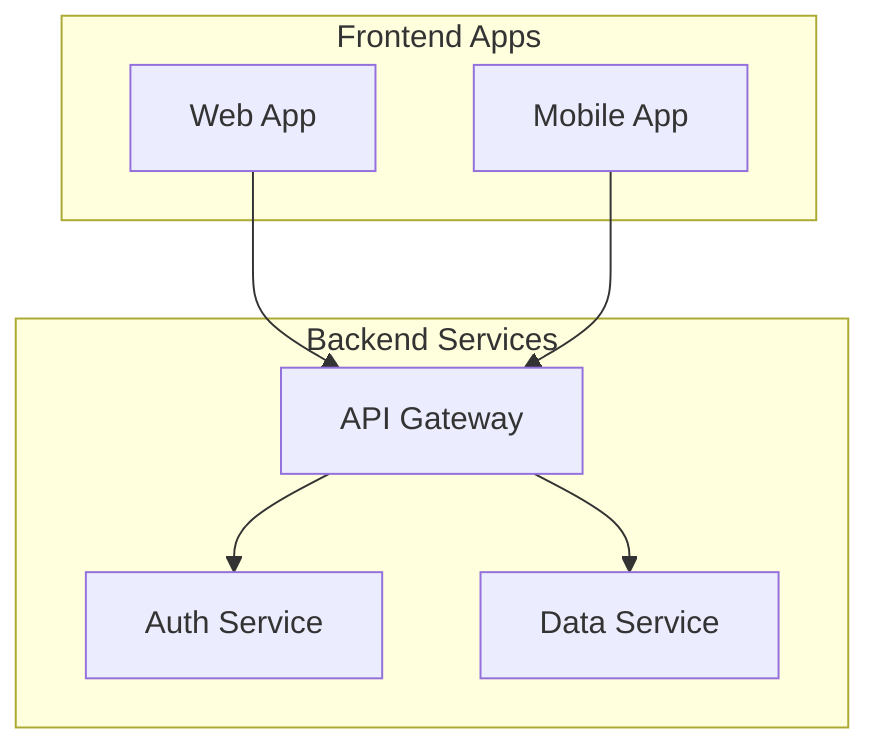
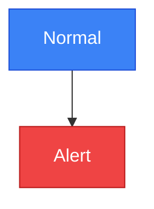
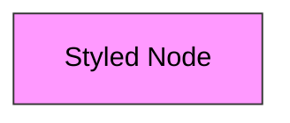
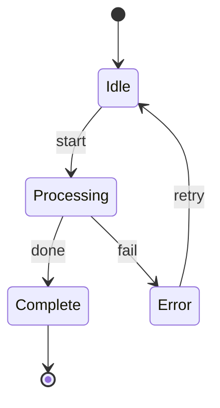
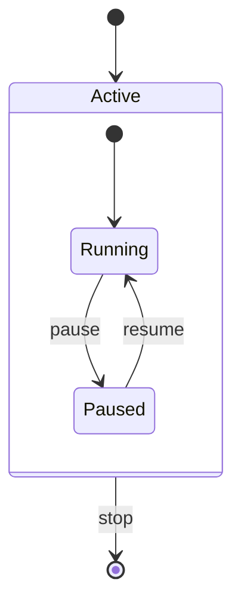

# Flowcharts & State Diagrams

## Flowchart Basics

Start with `graph` or `flowchart` followed by a direction:

| Direction | Meaning |
|-----------|---------|
| `TD` / `TB` | Top to bottom |
| `LR` | Left to right |
| `BT` | Bottom to top |
| `RL` | Right to left |

## Node Shapes

| Shape | Syntax | Use for |
|-------|--------|---------|
| Rectangle | `A[text]` | Default/process |
| Rounded | `A(text)` | Soft/general |
| Diamond | `A{text}` | Decision |
| Stadium | `A([text])` | Terminal/pill |
| Circle | `A((text))` | Events |
| Subroutine | `A[[text]]` | Predefined process |
| Double Circle | `A(((text)))` | Double event |
| Hexagon | `A{{text}}` | Preparation |
| Cylinder | `A[(text)]` | Database/storage |
| Asymmetric | `A>text]` | Flag/input |
| Trapezoid | `A[/text\]` | Manual operation |
| Inv Trapezoid | `A[\text/]` | Manual operation alt |

## Edge Types

| Type | Syntax | Appearance |
|------|--------|------------|
| Solid arrow | `-->` | ——▶ |
| Dotted arrow | `-.->` | - - ▶ |
| Thick arrow | `==>` | ══▶ |
| No arrow | `---` | —— |
| Dotted no arrow | `-.-` | - - - |
| Thick no arrow | `===` | ═══ |
| Bidirectional | `<-->` | ◀——▶ |
| Dotted bidirectional | `<-.->` | ◀- -▶ |
| Thick bidirectional | `<==>` | ◀══▶ |

### Edge Labels

### Parallel Links with `&`

### Chained Edges

## Subgraphs

Group related nodes:

- Use `direction` inside a subgraph to override layout
- Bracket syntax `subgraph id [Label]` sets the display label
- Subgraphs can be nested

## Styling

### Class Definitions

### Inline Styles

## State Diagrams

Use `stateDiagram-v2` for state machines:

- `[*]` at start = initial state (filled circle)
- `[*]` at end = final state (bullseye)
- `state "Description" as alias` for long names
- Composite states with `state CompositeState { ... }`

