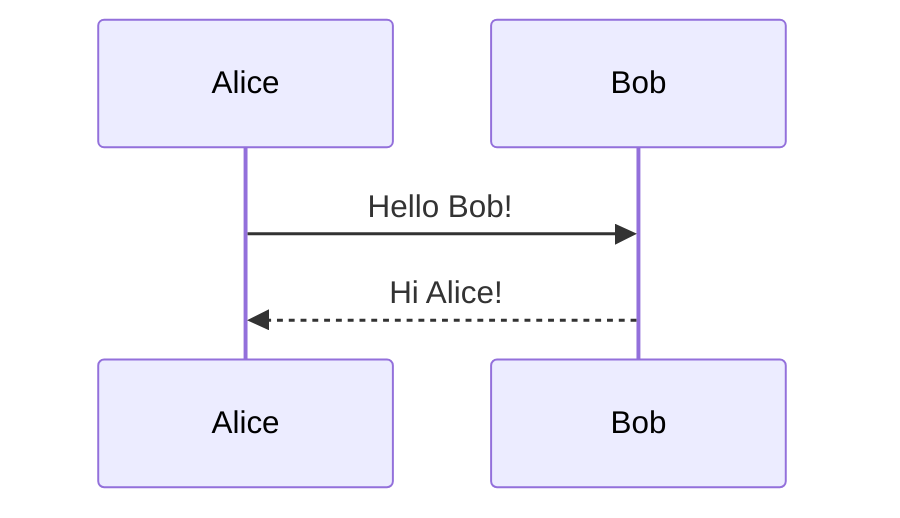
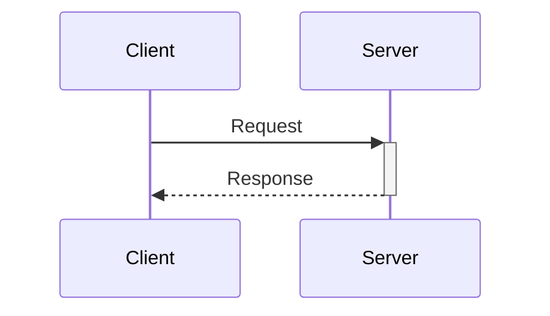
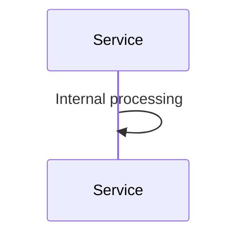
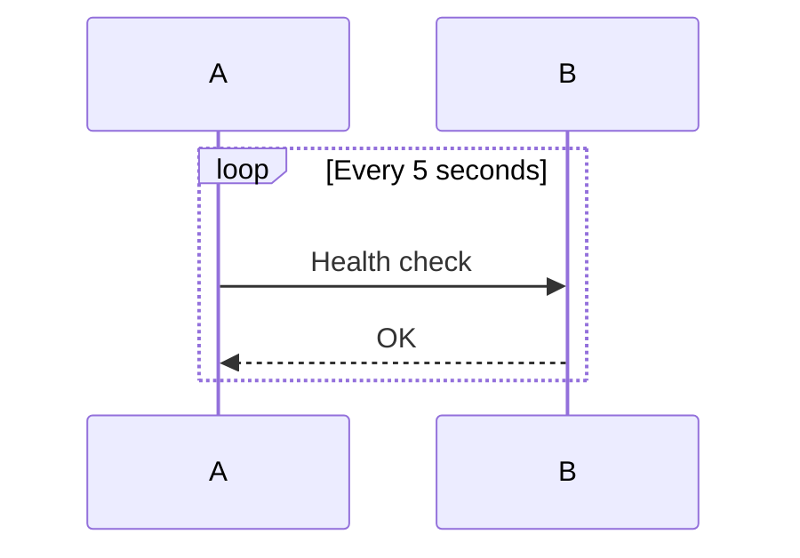
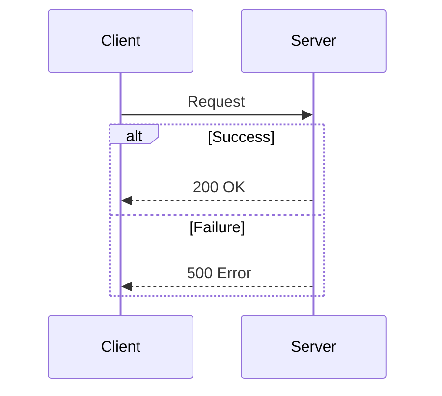
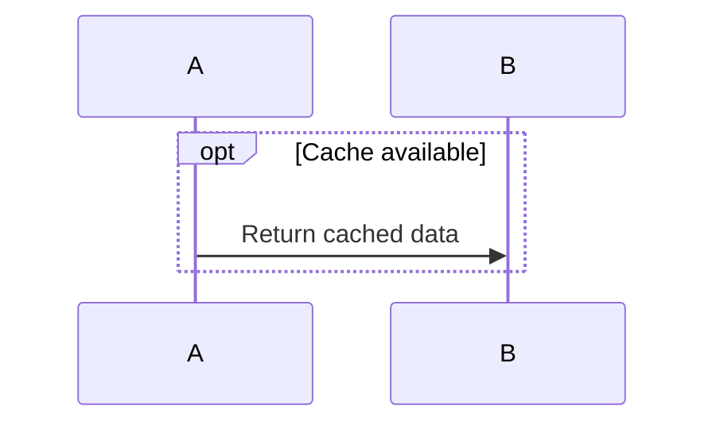
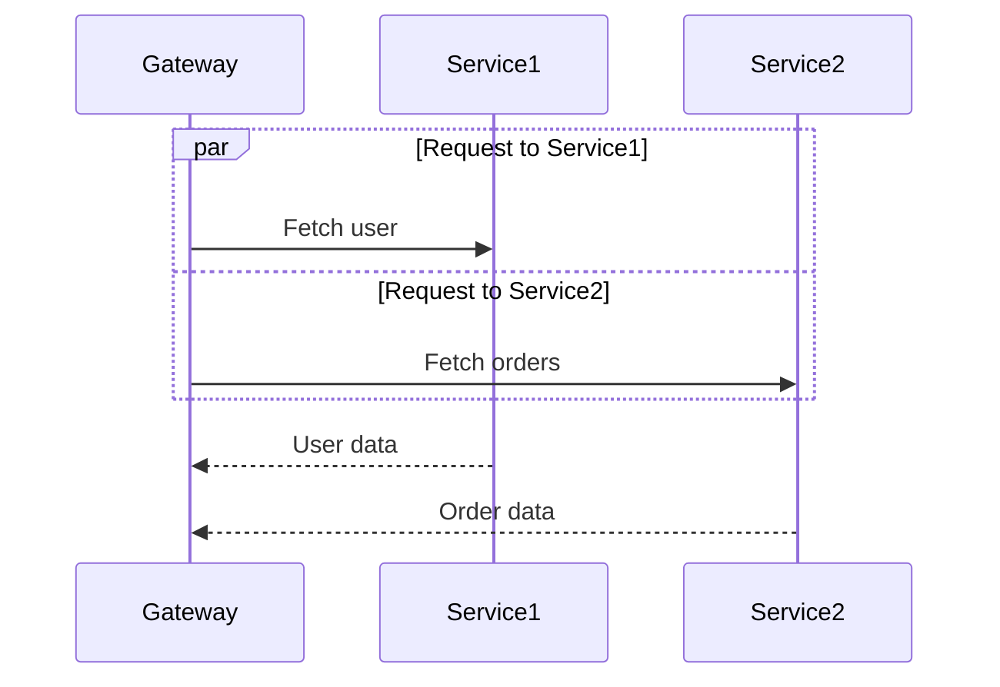
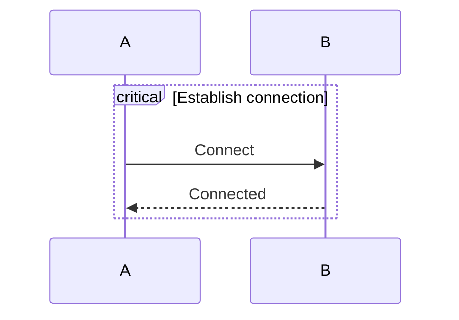
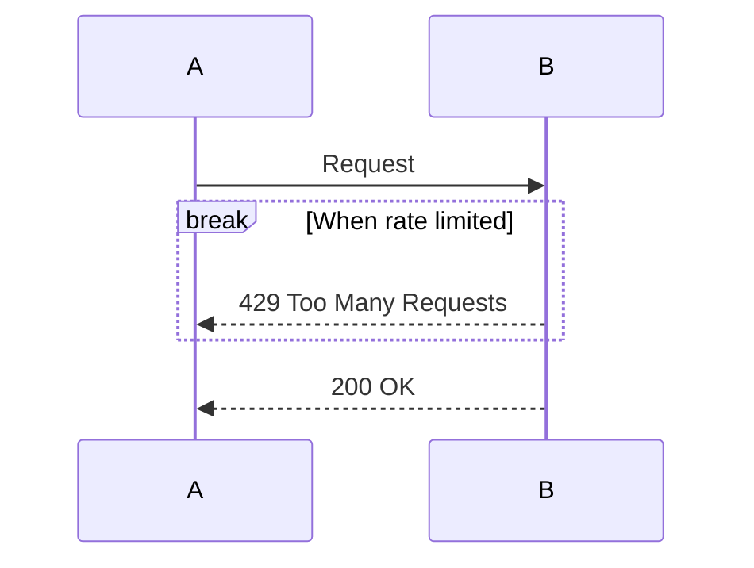
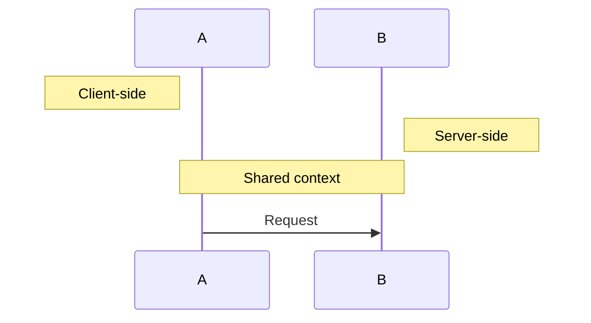

# Sequence Diagrams

## Basics

## Participant Types

- `participant A as Alice` — renders as a box
- `actor A as Alice` — renders as a stick figure

Participants appear in declaration order left-to-right.

## Arrow Types

| Syntax | Line | Arrowhead |
|--------|------|-----------|
| `->>` | Solid | Filled |
| `-->>` | Dashed | Filled |
| `-)` | Solid | Open |
| `--)` | Dashed | Open |

## Activation (Lifelines)

Use `+` to activate and `-` to deactivate:

## Self-Messages

A participant can send a message to itself:

## Blocks

### Loop

### Alt/Else (Conditional)

### Opt (Optional)

### Par (Parallel)

### Critical

### Break

## Notes

